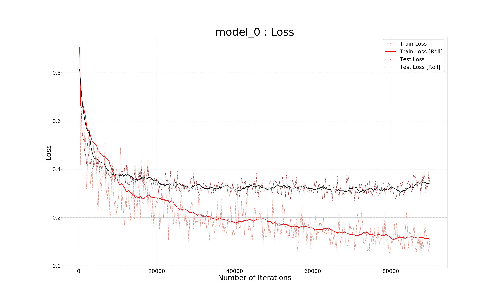

# FMNIST-classification-with-CNNs

- "model_0.ipynb" contains an initial implementation of a CNN that classifies FMNIST data and makes use of a custom dataset-class.
- "model_1.ipynb" contains a similar implementation, this using the standard pytorch dataset-class.
- These models import data from the "fmnist_data" folder.
- The "backup_files" folder contains the backup files that can be used to restore the the model to a previous state for visualising its performance or for training it further.
- The 'graphs' folder contains some graphs relating to the model's perfomance.

  __ACCURACY vs ITERATIONS__ 

  __LOSS vs ITERATIONS__ 

